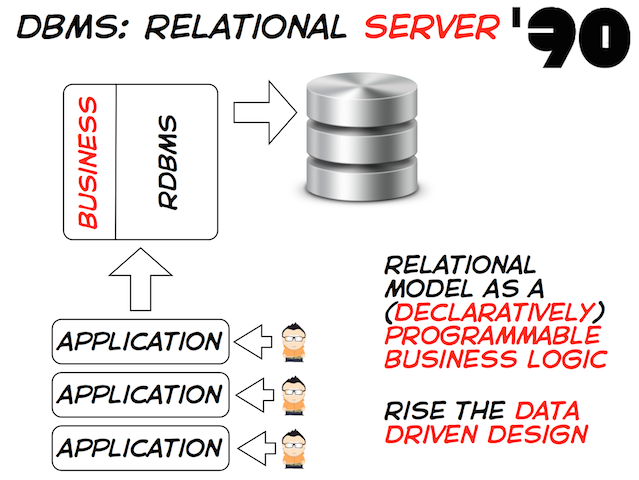
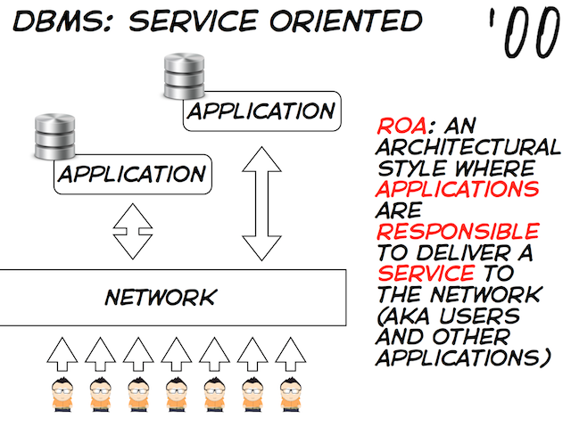
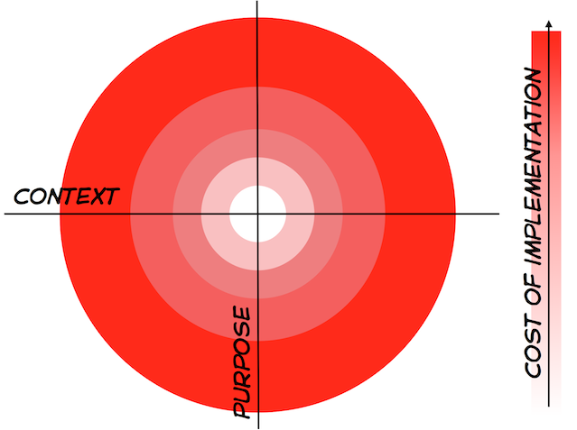
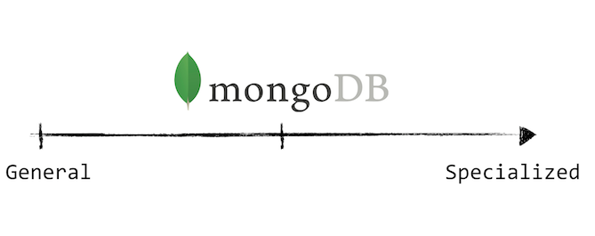
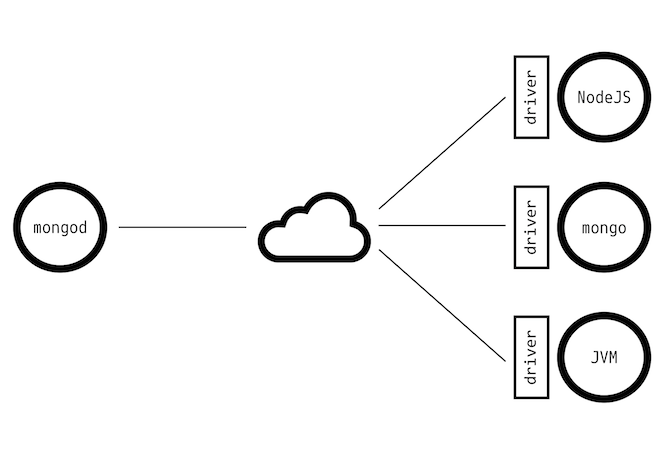
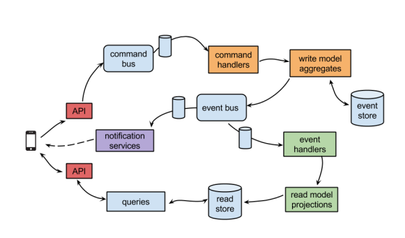

name: section
layout: true
class: center, middle, inverse

---

name: content
layout: true
class: top, left

---

template: section
# NoSql

---

template: content
# NoSql: Not Only SQL
.center[]

---

template: content
# SQL: Persistence it's a centralized service

.center[]

---

template: content
# NoSql: Persistence it's a service concern

.center[]

---

template: content
# NoSql: Avoid the Impedance Mismatch

.center[]

---

template: content
# NoSql: MongoDB

* You don't have to choose a "one size fits all" solution
* You can choose what's best for your data (aka specialized data storage)

.center[]

---

template: section
# MongoDB

---

template: content
# MongoDB: Document Oriented Database
```json
{
  "_id" : ObjectId("56669d14be2e0c48d102444c"),
  "address" : {
    "building" : "1007",
    "coord" : [-73.856077, 40.848447],
    "street" : "Morris Park Ave",
    "zipcode" : "10462"
  },
  "borough" : "Bronx",
  "cuisine" : "Bakery",
  "grades" : [
    {
      "date" : ISODate("2014-03-03T00:00:00Z"),
      "grade" : "A",
      "score" : 2
    },
    {
      "date" : ISODate("2013-09-11T00:00:00Z"),
      "grade" : "A",
      "score" : 6
    }
  ],
  "name" : "Morris Park Bake Shop",
  "restaurant_id" : "30075445"
}
```

---

template: content
# MongoDB: Terminology

.half-left[
## RDBMS
* Database
* Table
* Row
* Index
* Column
* Join
* Foreign Key
* Partition
]

.half-right[
## MongoDB
* **Database**
* **Collection**
* **Document**
* **Index**
* **Field**
* **Embedded**
* **Link**
* **Shard**
]

---

template: content
# MongoDB: Data Types (JSON/BSON)
* Double
* String
* Object
* Array
* Binary Data
* Object ID
* Boolean
* Date
* Null
* Regular Expression
* JavaScript
* JavaScript (with scope)
* Symbol
* 32-bit integer
* 64-bit integer
* Timestamp

---

template: content
# MongoDB: ObjectId

ObjectId is a 12-byte BSON type, constructed using:

* 4-byte timestamp
* 3-byte machine identifier
* 2-byte process id
* 3-byte counter, starting with a random value

In MongoDB, documents stored in a collection require a unique `_id` field that acts as a primary key. MongoDB uses `ObjectId` as the default value for the `_id` field if the `_id` field is not specified the MongoDB driver adds the `_id` field that holds an `ObjectId`. In addition, if the `mongod` receives a document to insert that does not contain an `_id` field, `mongod` will add the `_id` field that holds an `ObjectId`.

---

template: content
# MongoDB: Why? Flexible Data Model

```json
{
  "name": "Gabriele",
  "surname": "Lana",
  "email": "gabriele.lana@gmail.com"
}
```

> What if we need to store more than one email per user?

```json
{
  "name": "Gabriele",
  "surname": "Lana",
  "email": [
    "gabriele.lana@gmail.com",
    "gabriele.lana@cleancode.it"
  ]
}
```

---

template: content
# MongoDB: Flexible Data Model
* The *"schema"* is enforced by the application
* Collections can contain different *"types"* of documents but in practice they are pretty uniform
* It's gold at the beginning of the project when the *"schema"* is changing frequently (rapid prototyping)
* You still need migrations but much less
* Essential when your document grows in their lifetime (ex. Orders)

---

template: content
# MongoDB: Why? Where does it shine?
* Agile development
* Object oriented programming
* Event sourcing
* High performance on mixed workloads
* Scaling on demand
* High availability and auto failover
* Flexible schema ans secondary indexes
* Data driven organizations (prototypes)
* Commodity infrastructure
* Text indexing

---

template: content
# MongoDB: When?
* Internet of things (sensor data)
* Mobile applications (geospatial indexes)
* Real-time analytics
* Catalogs
* Content management
* Inventory management
* Shopping cart
* Messaging applications
* Log file aggregation
* Caching
* Adserving

---

template: content
# MongoDB: Client/Server

.center[]

---

template: content
# MongoDB: Shell

Connect to a specific database with `mongo <DATABASE-NAME>`
```shell
$ mongo examples
```

Connected to the database `examples`
```javascript
MongoDB shell version: 3.2.10
connecting to: examples
>
```

It's a javascript interpreter (V8)
```javascript
> 12 * 16
192

> "Hello MongoDB".split(" ")
[ "Hello", "MongoDB" ]

> (function(who) { return "Hello " + who })("MongoDB")
Hello MongoDB
```

---

template: content
# MongoDB: Shell

The database is represented with the global variable `db`
```javascript
> db.getName()
examples

> db.getName() === "examples"
true

> db
examples

> db.toString() === "examples"
true
```

You can switch database with the `use` command
```javascript
> use test
switched to db test

> db
test
```

---

template: content
# MongoDB: Shell

Collections can be selected with `db.getCollection` method or via dot notation
```javascript
> db.getCollectionNames()
> [ "restaurants", "system.indexes" ]

> db.getCollection("restaurants")
examples.restaurants

> db.restaurants
examples.restaurants

> db.restaurants.constructor
function DBCollection() { [native code] }
```

Collections and databases are created lazily when a document is inserted

---

template: section
# Insert, Query, Update and Delete

---

template: content
# Insert

We are going to insert our first document in a collection
```javascript
> db.coders.insert({
... username: "gabrielelana",
... email: "gabriele.lana@gmail.com"
... })

WriteResult({ "nInserted" : 1 })

> db.coders.count()
1

> db.coders.find()
{
  "_id" : ObjectId("5666d7d9348d8fdba2aa92fd"),
  "username" : "gabrielelana",
  "email" : "gabriele.lana@gmail.com"
}
```
* A collection `coders` has been created in database `examples`
* A document has been inserted in the collection `coders`
* The field `_id` has been added in the document with a new `ObjectId`
* Try to insert a document with an `_id` field and see what happens

---

template: content
# Query: Find

To query a collection we use `find(<QUERY>, <PROJECTION>)`

```javascript
> db.coders.find()
{
  "_id" : ObjectId("5666d7d9348d8fdba2aa92fd"),
  "username" : "gabrielelana",
  "email" : "gabriele.lana@gmail.com"
}
```

No query it's like an empty query `{}` and an empty query always matches, so `find()` retrieves all documents in a collection

```javascript
> db.coders.find({})
{
  "_id" : ObjectId("5666d7d9348d8fdba2aa92fd"),
  "username" : "gabrielelana",
  "email" : "gabriele.lana@gmail.com"
}
```

---

template: content
# Query: Find by Value

The most simple thing is to match documents based on values

```javascript
> db.coders.insert({
... username: "albertobrandolini",
... email: "alberto.brandolini@gmail.com"
... })
WriteResult({ "nInserted" : 1 })

> db.coders.find({username: "gabrielelana"})
{
  "_id" : ObjectId("5666d7d9348d8fdba2aa92fd"),
  "username" : "gabrielelana",
  "email" : "gabriele.lana@gmail.com"
}

> db.coders.find({username: "albertobrandolini"})
{
  "_id" : ObjectId("5666df1710e86a873c801e27"),
  "username" : "albertobrandolini",
  "email" : "alberto.brandolini@gmail.com"
}
```

---

template: content
# Query: Find by Value

We can match values on multiple fields

```javascript
> db.coders.find({username: "gabrielelana", email: "gabriele.lana@gmail.com"})
{
  "_id" : ObjectId("5666d875348d8fdba2aa92fe"),
  "username" : "gabrielelana",
  "email" : "gabriele.lana@gmail.com"
}
```

Same as combine multiple queries with an `$and` operator

```javascript
> db.coders.find({
... $and: [
...   {username: "gabrielelana"},
...   {email: "gabriele.lana@gmail.com"}
... ]})
{
  "_id" : ObjectId("5666d875348d8fdba2aa92fe"),
  "username" : "gabrielelana",
  "email" : "gabriele.lana@gmail.com"
}
```

---

template: content
# Query: Combinators

The `$or` operator behaves as expected
```javascript
> db.coders.find({
... $or: [
...   {username: "gabrielelana"},
...   {username: "albertobrandolini"}
... ]})
{
  "_id" : ObjectId("5666d875348d8fdba2aa92fe"),
  "username" : "gabrielelana",
  "email" : "gabriele.lana@gmail.com"
}
{
  "_id" : ObjectId("5666df1710e86a873c801e27"),
  "username" : "albertobrandolini",
  "email" : "alberto.brandolini@gmail.com"
}
```

---

template: content
# Query: Cursor

The `find` method returns a cursor, this means that a query it's not executed until the content of the cursor is not printed

```javascript
> r = db.coders.find()
{ "_id" : ObjectId("5666d875348d8fdba2aa92fe"), ...}
{ "_id" : ObjectId("5666df1710e86a873c801e27"), ...}

> r.constructor
function DBQuery() { [native code] }

> db.coders.find().count()
2

> db.coders.find().skip(1)
{ "_id" : ObjectId("5666df1710e86a873c801e27"), ...}

> db.coders.find().limit(1)
{ "_id" : ObjectId("5666d875348d8fdba2aa92fe"), ...}
```

Try to ask for help with `r.help()`

---

template: content
# Query: Project fields

You can limit the result to fields you are interested in
```javascript
> db.coders.find({}, {username: 1})
{ "_id" : ObjectId("5666d875348d8fdba2aa92fe"),
  "username" : "gabrielelana"
}
{ "_id" : ObjectId("5666df1710e86a873c801e27"),
  "username" : "albertobrandolini"
}

> db.coders.find({}, {username: 1, _id: 0})
{ "username" : "gabrielelana" }
{ "username" : "albertobrandolini" }

> db.coders.find({}, {_id: 0})
{ "username" : "gabrielelana",
  "email" : "gabriele.lana@gmail.com"
}
{ "username" : "albertobrandolini",
  "email" : "alberto.brandolini@gmail.com"
}
```

---

template: content
# Query: Comparison operators

Instead of values we can use comparison operators like, the simplest is `$eq` which is equivalent to the value itself

```javascript
> db.coders.find({username: "gabrielelana"})
{ "_id" : ObjectId("5666d875348d8fdba2aa92fe"),
  "username" : "gabrielelana",
  "email" : "gabriele.lana@gmail.com"
}

> db.coders.find({username: {$eq: "gabrielelana"}})
{ "_id" : ObjectId("5666d875348d8fdba2aa92fe"),
  "username" : "gabrielelana",
  "email" : "gabriele.lana@gmail.com"
}
```

The operator `$ne` it's the opposite

```javascript
> db.coders.find({username: {$neq: "gabrielelana"}})
{ "_id" : ObjectId("5666df1710e86a873c801e27"),
  "username" : "albertobrandolini",
  "email" : "alberto.brandolini@gmail.com"
}
```

---

template: content
# Query: Comparison operators

The operator `$in` could be a shortcut for the `$or` logical operator

```javascript
> db.coders.find({username: {$in: ["gabrielelana", "albertobrandolini"]}})
{ "_id" : ObjectId("5666d875348d8fdba2aa92fe"),
  "username" : "gabrielelana",
  "email" : "gabriele.lana@gmail.com"
}
{ "_id" : ObjectId("5666df1710e86a873c801e27"),
  "username" : "albertobrandolini",
  "email" : "alberto.brandolini@gmail.com"
}
```

The difference is that you can use only values inside the `$in` array whereas with `$or` you can compose arbitrary complex query objects

---

template: content
# Query: Comparison operators

To compare numbers use: `$lt`, `$lte`, `$gt`, `$gte`

```javascript
> db.inventory.insert({name: "Bread of Force", quantity: 9})
> db.inventory.insert({name: "Carpet of Flying", quantity: 2})
> db.inventory.insert({name: "Flame Extinguishing", quantity: 16})

> db.inventory.find({quantity: {$gt: 2}}, {_id: 0})
{ "name" : "Bread of Force" , "quantity": 9 }
{ "name" : "Flame Extinguishing", "quantity": 16 }

> db.inventory.find({quantity: {$lt: 9}}, {_id: 0})
{ "name" : "Carpet of Flying", "quantity": 2 }

> db.inventory.find({quantity: {$gt: 5, $lt: 10}}, {_id: 0})
{ "name" : "Bread of Force", "quantity" : 9 }
```

---

template: content
# Query: Find in embedded documents

```javascript
> db.restaurants.find({"address.zipcode": "10462"}, {name: 1, _id: 0})
{ "name" : "Morris Park Bake Shop" }
{ "name" : "The New Starling Athletic Club Of The Bronx" }
{ "name" : "Lulu'S Coffee Shop" }
{ "name" : "Bronx Grill" }
{ "name" : "Sabrosura Restaurant" }
{ "name" : "John & Joe Pizzeria & Restaurant" }
{ "name" : "Castlehill Diner" }
{ "name" : "Venice Pizza" }
{ "name" : "Wendy'S" }
{ "name" : "The Pizza Place" }
{ "name" : "Chick-N-Ribs" }
{ "name" : "Zaro'S Bread Basket" }
{ "name" : "Celeste'S Snack Bar" }
{ "name" : "Park Billiards" }
{ "name" : "Mcdonald'S" }
{ "name" : "Mcdonald'S" }
{ "name" : "Carvel Ice Cream" }
{ "name" : "Archer Sports Bar" }
{ "name" : "Pizza Express" }
{ "name" : "Johnny'S O'S" }
...
```

---

template: content
# Query: Array transparency

```javascript
> db.coders.insert({
... username: "filippoliverani",
... email: [
...   "filippo.liverani@gmail.com",
...   "filippo.liverani@xpeppers.it"]
... })
WriteResult({ "nInserted" : 1 })

> db.coders.find({email: "filippo.liverani@gmail.com"})
{ "_id" : ObjectId("5666f6fd10e86a873c801e2d"),
  "username" : "filippoliverani",
  "email" : [ "filippo.liverani@gmail.com", "filippo.liverani@xpeppers.it" ]
}

> db.coders.find({email: "filippo.liverani@xpeppers.it"})
{ "_id" : ObjectId("5666f6fd10e86a873c801e2d"),
  "username" : "filippoliverani",
  "email" : [ "filippo.liverani@gmail.com", "filippo.liverani@xpeppers.it" ]
}
```

---

template: content
# Query: Arrays of embedded documents

Find all restaurants with at least a grade after 2015

```javascript
> db.restaurants.find({"grades.date": {$gte: new Date(2015, 0, 0)}}).count()
242
> db.restaurants.find({"grades.date": {$gte: new Date(2015, 0, 0)}}).limit(1)
{
  "_id" : ObjectId("56669d14be2e0c48d1024473"),
  "address" : ...
  "borough" : "Staten Island",
  "cuisine" : "Delicatessen",
  "grades" : [
    {
      "grade" : "A",
      "score" : 3,
      "date" : ISODate("2015-01-09T00:00:00Z")
    },
    ...
  ],
  "name" : "Bagels N Buns",
  "restaurant_id" : "40363427"
}
```

---

template: content
# Query: Arrays of embedded documents

Find all restaurants with a **grade "A" after 2015**

```javascript
> db.restaurants
... .find({"grades.date": {$gte: new Date(2015, 0, 0)}, "grades.grade": "A"})
... .count()
240
```

... But in the result set

```javascript
{ ...
  "grades" : [
    { "date" : ISODate("2015-01-05T00:00:00Z"),
      "grade" : "B",
      "score" : 9
    },
    { "date" : ISODate("2014-07-02T00:00:00Z"),
      "grade" : "A",
      "score" : 2
    },
    ...
  ],
}
```

---

template: content
# Query: Arrays of embedded documents

You cannot use object as values in queries

```javascript
> db.restaurants.find(
...   {grades: {
...     date: {$gte: new Date(2015, 0, 0)},
...     grade: "A"
...   }}
... ).count()
0
```

You need to use `$elemMatch` operator

```javascript
> db.restaurants.find(
...   {grades: {
...     $elemMatch: {
...       date: {$gte: new Date(2015, 0, 0)},
...       grade: "A"
...     }
...   }}
... ).count()
190
```

---

template: content
# Query: Regular Expressions

Find all restaurants located in a "Street" (ex "East 66 Street")

```javascript
> db.restaurants.find({"address.street": /Street$/}).count()
1221
```

Find all restaurants located in a "Avenue" (ex "Stillwell Avenue")

```javascript
> db.restaurants.find({"address.street": /Avenue$/}).count()
1481
```

Find all restaurants that are **not located** in a "Street" or a "Avenue"
```javascript
> db.restaurants.find(
...   {$and: [
...     {"address.street": {$not: /Avenue$/}},
...     {"address.street": {$not: /Street$/}}
...   ]}
... ).count()
1069
```

---

template: content
# Query: Spatial Queries

Find all restaurants near (within 500 meters) Broadway (coordinates: -74.0164697, 40.7045116)

```javascript
> db.restaurants.createIndex({"address.coord": "2dsphere"})

> db.restaurants.find({
...   "address.coord": {
...     $near: {type: "Point", coordinates: [-74.0164697,40.7045116]},
...     $maxDistance: 500
...   }
... }).count()
21
```

Find a place in New York City and try it for yourself

---

template: content
# Query: Spatial Queries

Let's get crazy and show the full shell potential

```javascript
var latitude = 40.702147,
    longitude = -74.015794,
    center = [latitude, longitude].join(","),
    baseUrl = "https://maps.googleapis.com/maps/api/staticmap"
    params = "center=" + center + "&zoom=15&size=800x600&maptype=roadmap"

fromResturantToMarker = function(d) {
  return encodeURI(
    "markers=" + [
      "color:blue",
      "label:" + d.name,
      d.address.coord[1] + "," + d.address.coord[0]
    ].join("|"))
}

markers = db.restaurants.find({
  "address.coord": {
    $near: {type: "Point", coordinates: [longitude, latitude]},
    $maxDistance: 500
  }}
).map(fromResturantToMarker)

baseUrl + "?" + params + "&" + markers.join("&")
```

---

template: content
# Query: Sorting

Find the last graded restaurant. A negative values means **decreasing** order, a positive value mean **increasing** order

```javascript
> db.restaurants.find().sort({"grades.date": -1}).limit(1)
{ "_id" : ObjectId("56669d14be2e0c48d10249a1"),
  "address" : ...,
  "borough" : "Bronx",
  "cuisine" : "American ",
  "grades" : [
    {
      "score" : 4,
      "date" : ISODate("2015-01-20T00:00:00Z"),
      "grade" : "Not Yet Graded"
    }
  ],
  "name" : "Ambassador Diner",
  "restaurant_id" : "40403946"
}
```

Let's check to be sure ;-)

```javascript
> db.restaurants.find({"grades.date": {$gt: ISODate("2015-01-20T00:00:00Z")}})
```

---

template: content
# Query: The Last Resort

In the end you can always rely on `$where` operator, but be mind of the performance penalties!

Find all the restaurants that improved over time

```javascript
> db.restaurants.find({$where:
    function() {
      var grades = this.grades.sort(
        function(l, r) {
          return r.date.getTime() - l.date.getTime()
        }
      );
      for (var i=0; i<grades.length-1; i++) {
        if (grades[i].score > grades[i+1].score) {
          return false
        }
      }
      return true
    }
  }).count()

203
```

---

template: content
# Query: Conclusions

* Queries as objects are easier to compose programmatically (like an AST)
* Not as powerful as SQL but powerful enough for most of the usages
* For a beginner it's more straightforward than SQL
* Easy to be extended programmatically (look at mongodb-shell-extensions)
* When you get used to it it's mostly OK ;-)

---

template: content
# Update

To update a document we use `update(<QUERY>, <UPDATE>, <OPTIONS>)`. The `<QUERY>` parameter is the same as in `find`. The `<UPDATE>` parameter could be an object value that will replace the matching document.

```javascript
> gabriele = db.coders.findOne({username: "gabrielelana"})
{ "_id" : ObjectId("5666d875348d8fdba2aa92fe"),
  "username" : "gabrielelana",
  "email" : "gabriele.lana@gmail.com"
}

> gabriele.email = [gabriele.email, "gabriele.lana@cleancode.it"]
[ "gabriele.lana@gmail.com", "gabriele.lana@cleancode.it" ]

> db.coders.update({username: "gabrielelana"}, gabriele)
WriteResult({ "nMatched" : 1, "nUpserted" : 0, "nModified" : 1 })

> db.coders.findOne({username: "gabrielelana"})
{ "_id" : ObjectId("5666d875348d8fdba2aa92fe"),
  "username" : "gabrielelana",
  "email" : [
    "gabriele.lana@gmail.com",
    "gabriele.lana@cleancode.it"
  ]
}
```

---

template: content
# Update

If the replacing document doesn't have an `ObjectId` one is generated

```javascript
> db.coders.update({username: "gabrielelana"}, {fake: true})
WriteResult({ "nMatched" : 1, "nUpserted" : 0, "nModified" : 1 })

> db.coders.findOne({username: "gabrielelana"})
null

> db.coders.findOne({fake: true})
{ "_id" : ObjectId("5666d875348d8fdba2aa92fe"), "fake" : true }

> db.coders.update({fake: true}, gabriele)
WriteResult({ "nMatched" : 1, "nUpserted" : 0, "nModified" : 1 })

> db.coders.find({}, {username: 1, _id: 0})
{ "username" : "albertobrandolini" }
{ "username" : "filippoliverani" }
{ "username" : "gabrielelana" }
```

---

template: content
# Update

In the `<UPDATE>` parameter we can use update operators, the first is `$set`

```javascript
> db.coders.update({username: "gabrielelana"}, {$set: gabriele})
WriteResult({ "nMatched" : 1, "nUpserted" : 0, "nModified" : 0 })

> db.coders.findOne({username: "gabrielelana"})
{ "_id" : ObjectId("5666d875348d8fdba2aa92fe"),
  "username" : "gabrielelana",
  "email" : [
    "gabriele.lana@gmail.com",
    "gabriele.lana@cleancode.it"
  ]
}
```

With `$set` you can replace a single field without fetching the document

```javascript
> db.coders.update(
... {username: "gabrielelana"},
... {$set: {"email": "gabriele.lana@gmail.com"}})
WriteResult({ "nMatched" : 1, "nUpserted" : 0, "nModified" : 1 })

> db.coders.findOne({username: "gabrielelana"}, {_id: 0, email: 1})
{ "email" : "gabriele.lana@gmail.com" }
```

---

template: content
# Update: Multiple Documents

Add `skills: ["coding"]` to all the coders

```javascript
> db.coders.update({}, {$set: {skills: ["coding"]}})
WriteResult({ "nMatched" : 1, "nUpserted" : 0, "nModified" : 1 })

> db.coders.find({}, {skills: 1})
{ "_id" : ObjectId("5666f6fd10e86a873c801e2d") }
{ "_id" : ObjectId("5666d875348d8fdba2aa92fe") }
{ "_id" : ObjectId("5666df1710e86a873c801e27"), "skills" : [ "coding" ] }
```

By defaults `update` works only on the first matching document, use `{multi: true}` option

```javascript
> db.coders.update({}, {$set: {skills: ["coding"]}}, {multi: true})
WriteResult({ "nMatched" : 3, "nUpserted" : 0, "nModified" : 2 })

> db.coders.find({}, {skills: 1})
{ "_id" : ObjectId("5666f6fd10e86a873c801e2d"), "skills" : [ "coding" ] }
{ "_id" : ObjectId("5666d875348d8fdba2aa92fe"), "skills" : [ "coding" ] }
{ "_id" : ObjectId("5666df1710e86a873c801e27"), "skills" : [ "coding" ] }
```

---

template: content
# Update: Update or Insert

```javascript
var hit = function(url, day) {
  visit = db.visits.findOne({url: url, at: day})
  if (visit === null) {
    db.visits.insert({url: url, at: day, hits: 1})
  } else {
    db.visits.update({url: url, at: day}, {$set: {hits: visit.hits + 1}})
  }
}

> hit("http://corriere.it", "2015/12/09")

> db.visits.find({}, {_id: 0})
{ "url" : "http://corriere.it", "at" : "2015/12/09", "hits" : 1 }

> hit("http://corriere.it", "2015/12/09")

> db.visits.find({}, {_id: 0})
{ "url" : "http://corriere.it", "at" : "2015/12/09", "hits" : 2 }
```

Mehhh...

---

template: content
# Update: Update or Insert

Option `{upsert: true}` to the rescue

```javascript
> db.visits.drop()
> db.visits.update(
... {url: "http://corriere.it", at: "2015/12/09"},
... {$set: {hits: 1}},
... {upsert: true})
WriteResult({"nMatched" : 0, "nUpserted" : 1, "nModified" : 0})

> db.visits.find({}, {_id: 0})
{ "at" : "2015/12/09", "url" : "http://corriere.it", "hits" : 1 }
```

Ok, but now? How could I increase the hits?

---

template: content
# Update: Update or Insert

Increase counters with `$inc` operator

```javascript
> db.visits.drop()
> db.visits.update(
... {url: "http://corriere.it", at: "2015/12/09"},
*... {$inc: {hits: 1}},
... {upsert: true})
WriteResult({"nMatched" : 0, "nUpserted" : 1, "nModified" : 0})

> db.visits.find({}, {_id: 0})
{ "at" : "2015/12/09", "url" : "http://corriere.it", "hits" : 1 }
```

When you do it again...

```javascript
> db.visits.update(
... {url: "http://corriere.it", at: "2015/12/09"},
*... {$inc: {hits: 1}},
... {upsert: true})
*WriteResult({"nMatched" : 1, "nUpserted" : 0, "nModified" : 1})

> db.visits.find({}, {_id: 0})
{ "at" : "2015/12/09", "url" : "http://corriere.it", "hits" : 2 }
```

---

template: content
# Update: Multiple Operators

You can use multiple operators in the same update and all the operators are applied in an atomic way. Here we will use `$inc` and `$set` at the same time

```javascript
> db.visits.update(
... {url: "http://corriere.it", at: "2015/12/09"},
*... {$inc: {hits: 1}, $set: {updated_at: new ISODate()}},
... {upsert: true})
WriteResult({ "nMatched" : 1, "nUpserted" : 0, "nModified" : 1 })

> db.visits.find({}, {_id: 0, hists: 1, updated_at: 1})
{ "hits" : 3, "updated_at" : ISODate("2015-12-09T08:13:24.379Z") }

> db.visits.update(
... {url: "http://corriere.it", at: "2015/12/09"},
*... {$inc: {hits: 1}, $set: {updated_at: new ISODate()}},
... {upsert: true})
WriteResult({ "nMatched" : 1, "nUpserted" : 0, "nModified" : 1 })

> db.visits.find({}, {_id: 0, hists: 1, updated_at: 1})
{ "hits" : 4, "updated_at" : ISODate("2015-12-09T08:13:34.638Z") }
```

---

template: content
# Update: Only on Insert

You can add a field only when the `update` results in an `insert` with `$setOnInsert`

```javascript
> db.visits.drop()
> db.visits.update(
... {url: "http://www.corriere.it", at: "2015/12/09"},
... {$inc: {hits: 1},
...  $set: {updated_at: new ISODate()},
*...  $setOnInsert: {created_at: new ISODate()}},
... {upsert: true})

> db.visits.find({}, {_id: 0, updated_at: 1, created_at: 1)
{ "updated_at" : ISODate("2015-12-09T08:18:36.039Z"),
* "created_at" : ISODate("2015-12-09T08:18:36.039Z")
}

> // do it again and...

> db.visits.find({}, {_id: 0, updated_at: 1, created_at: 1)
{ "updated_at" : ISODate("2015-12-09T08:22.271Z"),
* "created_at" : ISODate("2015-12-09T08:18:36.039Z")
}
```

---

template: content
# Update: On Arrays

There are specific operators for arrays like `$push`

```javascript
> db.coders.update({username: "gabrielelana"}, {$push: {skills: "MongoDB"}})
WriteResult({ "nMatched" : 1, "nUpserted" : 0, "nModified" : 1 })

> db.coders.findOne({username: "gabrielelana"})
{ "_id" : ObjectId("5666d875348d8fdba2aa92fe"),
  "username" : "gabrielelana",
  "email" : "gabriele.lana@gmail.com",
  "skills" : [
    "coding",
    "MongoDB"
  ]
}
```

---

template: content
# Update: On Arrays

What if you want to add skills without repetition? Use `$addToSet`

```javascript
> db.coders.update(
... {username: "gabrielelana"},
... {$addToSet: {skills: "JavaScript"}})
*WriteResult({ "nMatched" : 1, "nUpserted" : 0, "nModified" : 1 })

> db.coders.update(
... {username: "gabrielelana"},
... {$addToSet: {skills: "JavaScript"}})
*WriteResult({ "nMatched" : 1, "nUpserted" : 0, "nModified" : 0 })

> db.coders.findOne({username: "gabrielelana"})
{ "_id" : ObjectId("5666d875348d8fdba2aa92fe"),
  "username" : "gabrielelana",
  "email" : "gabriele.lana@gmail.com",
  "skills" : [
    "coding",
    "MongoDB",
    "JavaScript"
  ]
}
```

---

template: content
# Remove

To remove a document we use `remove(<QUERY>, <OPTIONS>)`. The `<QUERY>` parameter is the same as in `find`.

```javascript
> db.coders.remove({username: "gabrielelana"})
WriteResult({ "nRemoved" : 1 })

> db.coders.find({}, {_id: 0, username: 1})
{ "username" : "filippoliverani" }
{ "username" : "albertobrandolini" }
```

By default it removes all documents matching `<QUERY>`

```javascript
> db.coders.remove({})
WriteResult({ "nRemoved" : 2 })

> db.coders.count()
0
```

---

template: content
# Remove: Single Document

To remove a single document you can be selective with `<QUERY>` or you can use the `{justOne: true}` option

```javascript
> db.visits.find({}, {_id: 1})
{ "_id" : ObjectId("5667df0abe2e0c48d1025308") }
{ "_id" : ObjectId("5667e3dcbe2e0c48d1025309") }

*> db.visits.remove({}, {justOne: true})
WriteResult({ "nRemoved" : 1 })

> db.visits.find({}, {_id: 1})
{ "_id" : ObjectId("5667e3dcbe2e0c48d1025309") }

*> db.visits.remove(ObjectId("5667e3dcbe2e0c48d1025309"))
WriteResult({ "nRemoved" : 1 })
```

---

template: section
# Indexing and Query Optimization

---

template: content
# Indexes

* Very important to understand to use MongoDB
* Most used query on big collections should be indexed
* With indexes MongoDB can use IO, CPU and memory more efficiently
* Wrong indexes will result in slow queries, slow writes and poorly utilized hardware
* Without an index the only way to satisfy a query is to scan all documents linearly
* Only one index can be selected per query (not true for MongoDB > 2.6)

---

template: content
# Indexes: Single Key

Every collection has at least one index on `_id` field

```javascript
> use garden

> db.users.getIndexes()
[ { "v" : 1,
    "key" : {
      "_id" : 1
    },
    "name" : "_id_",
    "ns" : "garden.users"
  }
]
```

---

template: content
# Indexes: Explain

Using method `explain(<VERBOSE>)` on cursor we could find out if we are using an index or not

```javascript
> db.users.find({username: "thawkins"}, {_id: 1})
{ "_id" : ObjectId("4c4b1476238d3b4dd5000003") }

> db.users.find({username: "thawkins"}).explain(true)
// look at the result

> db.users.find({_id: ObjectId("4c4b1476238d3b4dd5000003")).explain(true)
// look at the result

> db.users.createIndex({username: 1})
> db.users.getIndexes()
// look at the result

> db.users.find({username: "thawkins"}).explain(true)
// look at the result
```

---

template: content
# Indexes: Unique

To ensure a field is unique we can create an unique index with `{unique: true}` option

```javascript
> db.users.dropIndex("username_1")
{ "nIndexesWas" : 2, "ok" : 1 }

> db.users.createIndex({username: 1}, {unique: true})
// created index with unique constraint

> db.users.find({username: "thawkins"}, {_id: 1})
{ "_id" : ObjectId("4c4b1476238d3b4dd5000003") }

> db.users.insert({username: "thawkins"})
WriteResult({
  "nInserted" : 0,
  "writeError" : {
    "code" : 11000,
    "errmsg" : "E11000 duplicate key error... "
  }
})
```

---

template: content
# Indexes: Sparse

You want to create a sparse index with `{sparse: true}` option when:
* The field to be indexes gets populated only later in the lifetime of the document, problematic especially with an unique index
* The field it's not common to all the documents, with a sparse index you can save disk space and computation time on write

```javascript
> db.products.createIndex({sku: 1}, {unique: true, sparse: true})
{ "createdCollectionAutomatically" : false,
  "numIndexesBefore" : 1,
  "numIndexesAfter" : 2,
  "ok" : 1
}

> db.products.getIndexes()
// look at the result

> db.system.indexes.find()
// look at the result
```

---

template: content
# Indexes: Compound

You can created indexes on multiple fields
* Fields order in query is not relevant
* Compound indexes can be partially used but with some restrictions

```javascript
> db.restaurants.createIndex({cuisine: 1, borough: 1})
> db.restaurants.find({cuisine: "Bakery", borough: "Bronx"})
// uses the index, see with explain

> db.restaurants.find({borough: "Bronx", cuisine: "Bakery"})
// uses the same index, see with explain

> db.restaurants.find({cuisine: "Bakery"})
// still uses (partially) the same index as before, see with explain

> db.restaurants.find({borough: "Bronx"})
// doesn't use the index, see with explain
```

---

template: content
# Indexes: Sort

If you don't use an index the sorting is done in memory and could be a major performance hit

```javascript
> db.restaurants.find({cuisine: "Bakery", borough: "Bronx"}).sort({name: 1})
// uses the compound index {cousine: 1, borough: 1}
// but sort is done in memory

> db.restaurants.createIndex({cuisine: 1, borough: 1, name: 1})
// NOTE: now the previous index is redundant/useless

> db.restaurants.find({cuisine: "Bakery", borough: "Bronx"}).sort({name: 1})
// uses the compound index and sort is done through index

> db.restaurants.find({cuisine: "Bakery"}).sort({borough: 1, name: 1})
// uses the index to sort

> db.restaurants.find({cuisine: "Bakery"}).sort({borough: -1, name: -1})
// uses the index to sort

> db.restaurants.find({cuisine: "Bakery"}).sort({borough: 1, name: -1})
// sort in memory!!!
```

---

template: content
# Indexes: Covering

The ultimate performance: respond to a query only using the index

```javascript
> db.restaurants.find(
...   {cuisine: "Bakery", borough: "Bronx"},
...   {_id: 0, name: 1}
... ).sort({name: 1})
{ "name" : "Angelica'S Bakery" }
{ "name" : "Biarritz Bakery" }
{ "name" : "Caffe Egidio" }
{ "name" : "Champion Bakery" }
{ "name" : "E & L Bakery & Coffee Shop" }
...

// look with explain, there's no FETCH in winning plan
// look with explain(true), "executionStats.totalDocsExamined" == 0
```

---

template: content
# Indexes: Identify Slow Queries

```javascript
> use stocks
> db.values.find({stock_symbol: "GOOG"}).sort({date: -1}).limit(1)
// it's gonna be slow, let's find out how to spot it

> db.setProfilingLevel(1, 50)
// log queries slower than 50 milliseconds

> db.values.find({stock_symbol: "GOOG"}).sort({date: -1}).limit(1)
> db.system.profile.find()
// look at the slow query and fix it

> db.setProfilingLevel(0)
```

---

template: content
# Indexes: Full Text

We can create a full text index on multiple fields:
* Automatic real-time indexing with stemming
* Optional assignable weights by field name
* Multilanguage support
* Stop words removal
* Exact phrase or word matches
* Exclude results with a given word or phrase

```javascript
> use examples

> db.books.count()
431
```

---

template: content
# Indexes: Full Text

```javascript
> db.books.findOne()
{ "_id" : 1,
  "title" : "Unlocking Android",
  "isbn" : "1933988673",
  "pageCount" : 416,
  "publishedDate" : ISODate("2009-04-01T07:00:00Z"),
  "thumbnailUrl" : "https://s3.amazonaws.com/...",
  "shortDescription" : "Unlocking Android: ...",
  "longDescription" : "Android is an open source ...",
  "status" : "PUBLISH",
  "authors" : ["W. Frank Ableson", "Charlie Collins", "Robi Sen"],
  "categories" : [
    "Open Source",
    "Mobile"
  ]
}
```

---

template: content
# Indexes: Full Text

```javascript
> db.books.stats()

> db.books.createIndex(
...   {title: "text",
...    shortDescription: "text",
...    longDescription: "text",
...    authors: "text",
...    categories: "text"},
...   {weights:
...     {title: 10,
...      shortDescription: 3,
...      longDescription: 1,
...      authors: 1,
...      categories: 5}}
... )

> db.books.stats()
// the size of the index is larger than the whole collection!
```

---

template: content
# Indexes: Full Text

```javascript
> db.books.find({$text: {$search: "actions"}}, {_id: 0, title: 1})
{ "title" : "Flexible Rails" }
{ "title" : "SQR in PeopleSoft and Other Applications" }
{ "title" : "SOA Security" }
{ "title" : "Ruby for Rails" }
{ "title" : "Android in Action, Third Edition" }
{ "title" : "Mule in Action, Second Edition" }
...

> db.books.find({$text: {$search: '"MongoDB in Action"'}}, {_id: 0, title: 1})
{ "title" : "MongoDB in Action, Second Edition" }
{ "title" : "MongoDB in Action" }
```

---

template: content
# Indexes: Full Text

```javascript
> db.books.find(
...   {$text: {$search: "actions"}},
...   {_id: 0, title: 1, score: {$meta: "textScore"}})
{ "title" : "Flexible Rails", "score" : 0.5022026431718062 }
{ "title" : "Android in Action, Third Edition", "score" : 6.25 }
{ "title" : "SOA Security", "score" : 0.5053191489361702 }
...

> db.books.find(
...   {$text: {$search: "actions"}},
...   {_id: 0, title: 1, score: {$meta: "textScore"}}
... ).sort({score: {$meta: "textScore"}})
{ "title" : "Spring Batch in Action", "score" : 11.666666666666666 }
{ "title" : "Hadoop in Action", "score" : 10.8381456241033 }
{ "title" : "HTML5 in Action", "score" : 10.63548951048951 }
{ "title" : "Jess in Action", "score" : 9.813092979127134 }
{ "title" : "MongoDB in Action", "score" : 9.801655335501033 }
{ "title" : "Seam in Action", "score" : 9.799644473173885 }
...
```

---

template: content
# Indexes: Conclusions

* Lookout for hit on write performance
* More restrictive field first wins in performance for compound indexes
* Watch out for the field order in compound indexes
* Remove unused indexes
* Indexes are almost always good for mostly read loads
* Indexes must fit in memory if possible

---

template: section
# Aggregation Framework

---

template: content
# Aggregation Framework: Pipeline

Possible stages

* `$project`: Specify fields to be placed in the output document
* `$match`: Select documents to be processed (like `find`)
* `$limit`: Limit the number of documents to be passed to the next step
* `$skip`: Skip a specified number of documents
* `$unwind`: Expand an array, generating one output document for each array entry
* `$group`: Group documents by a specified key
* `$sort`: Sort documents
* `$geoNear`: Select documents near a geospatial location
* `$out`: Write the results of a pipeline to a collection

Details

* You can use it with `aggregate([<STAGE>, <STAGE>, ...])` method on collection
* Every stage could be repeated more than one time
* The result is a cursor (was a document in MongoDB <= 2.6)

---

template: content
# Aggregation Framework: Group

Count number of reviews for each product with `aggregate([$group])`

```javascript
> use garden

> db.reviews.aggregate([{$group: {_id: "$product_id", count: {$sum: 1}}}])
{ "_id" : ObjectId("4c4b1476238d3b4dd5003982"), "count" : 2 }
{ "_id" : ObjectId("4c4b1476238d3b4dd5003981"), "count" : 3 }
```

* The field to group by is `_id`
* Input document fields are specified by preceding them with `$` sign, in this case we have `"$product_id"`
* Other fields could be *aggregated* with various [accumulator operators](https://docs.mongodb.org/v3.0/reference/operator/aggregation/group/#pipe._S_group)

---

template: content
# Aggregation Framework: Group

Average review for a product

```javascript
> db.reviews.aggregate([
...   {$group: {_id: "$product_id",
*...             average: {$avg: "$rating"},
...             count: {$sum: 1}}}
... ])
{ "_id" : ObjectId("4c4b1476238d3b4dd5003982"),
  "average" : 3.5,
  "count" : 2 }
{ "_id" : ObjectId("4c4b1476238d3b4dd5003981"),
  "average" : 4.333333333333333,
  "count" : 3 }
```

---

template: content
# Aggregation Framework: Match

Counting reviews on a product by rating (Like what you see on Amazon: 5 reviews with 4 stars, 3 reviews with 3 starts, ...)

```javascript
> db.reviews.aggregate([
*...   {$match: {"product_id": ObjectId("4c4b1476238d3b4dd5003981")}},
...   {$group: {_id: "$rating", count: {$sum: 1}}}
... ])
{ "_id" : 5, "count" : 1 }
{ "_id" : 4, "count" : 2 }
```

---

template: content
# Aggregation Framework: Out

Count products in main categories and save report in `main_category_summary` collection

```javascript
> db.products.aggregate([
...   {$group: {"_id": "$main_cat_id", count: {$sum: 1}}},
...   {$out: "main_category_summary"}
... ])

> db.main_category_summary.find()
{ "_id" : ObjectId("6a5b1476238d3b4dd5000048"), "count" : 2 }
```

We miss the category name in the output, solutions:
* `db.main_category_summary.find().forEach(function(d) { ... })`
* `$lookup` only for MongoDB >= 3.2

---

template: content
# Aggregation Framework: Project

Count products in categories. A product is in only one main category but could be in many categories. As a first stage we will limit the document to the only field that matter to use with `$project`

```javascript
> db.products.aggregate([{$project: {category_ids: 1}}])
{ "_id" : ObjectId("4c4b1476238d3b4dd5003982"),
  "category_ids" : [
    ObjectId("6a5b1476238d3b4dd5000048"),
    ObjectId("6a5b1476238d3b4dd5000049")
  ]
}
{ "_id" : ObjectId("4c4b1476238d3b4dd5003981"),
  "category_ids" : [
    ObjectId("6a5b1476238d3b4dd5000048"),
    ObjectId("6a5b1476238d3b4dd5000049")
  ]
}
```

Limiting the size of the documents in the pipeline could significantly improve the pipeline performance

---

template: content
# Aggregation Framework: Unwind

Count products in categories. After `$project` we have on document with many categories. With `$unwind` we will explode each category in its own document, other fields are copied as they are

```javascript
> db.products.aggregate([
...   {$project: {category_ids: 1}},
...   {$unwind: "$category_ids"}
... ])

{ "_id" : ObjectId("4c4b1476238d3b4dd5003982"),
  "category_ids" : ObjectId("6a5b1476238d3b4dd5000048")
}
{ "_id" : ObjectId("4c4b1476238d3b4dd5003982"),
  "category_ids" : ObjectId("6a5b1476238d3b4dd5000049")
}
{ "_id" : ObjectId("4c4b1476238d3b4dd5003981"),
  "category_ids" : ObjectId("6a5b1476238d3b4dd5000048")
}
{ "_id" : ObjectId("4c4b1476238d3b4dd5003981"),
  "category_ids" : ObjectId("6a5b1476238d3b4dd5000049")
}
```

---

template: content
# Aggregation Framework: Unwind

Count product in categories. Now let's group products by category

```javascript
> db.products.aggregate([
...   {$project: {category_ids: 1}},
...   {$unwind: "$category_ids"},
...   {$group: {_id: "$category_ids", count: {$sum: 1}}}
... ])

{ "_id" : ObjectId("6a5b1476238d3b4dd5000049"), "count" : 2 }
{ "_id" : ObjectId("6a5b1476238d3b4dd5000048"), "count" : 2 }
```

---

template: content
# Aggregation Framework: Group Functions

* `$addToSet`: Creates an array of unique values of the group
* `$first`: The first value in a group. Makes sense only if preceded by `$sort`
* `$last`: The last value in a group. Makes sense only if preceded by `$sort`
* `$max`: The maximum value of a field for a group
* `$min`: The minimum value of a field for a group
* `$avg`: Average value for a field
* `$push`: Returns an array of all values for the group
* `$sum`: Sum all values in a group


---

template: content
# Aggregation Framework: Reshaping

The MongoDB aggregation framework contains a number of functions you can use to reshape a document and thus produce an output document that contains fields not in the original input document

```javascript
db.users.aggregate([
...   {$project: {name: {$concat: ["$first_name", " ", "$last_name"]},
...               first_initial: {$substr: ["$first_name", 0, 1]},
...               normalized_username: {$toUpper: "$username"}}}
... ])

{ "_id" : ObjectId("4c4b1476238d3b4dd5000002"),
  "name" : "Peter Bakkum",
  "first_initial" : "P",
  "normalized_username" : "PBAKKUM" }
{ "_id" : ObjectId("4c4b1476238d3b4dd5000003"),
  "name" : "Tim Hawkins",
  "first_initial" : "T",
  "normalized_username" : "THAWKINS"
}
...
```

---

template: content
# Aggregation Framework: Example

Find out which are the top 6 related books of book with id `312`

```javascript
> use examples

> db.books.findOne({_id: 132})
{ "_id" : 312,
  "title" : "JDK 1.4 Tutorial",
  "isbn" : "1930110456",
  "pageCount" : 408,
  "publishedDate" : ISODate("2002-03-01T08:00:00Z"),
  "thumbnailUrl" : "https://s3.amazonaws.com/AKIAJC5RLADLU...",
  "longDescription" : "Java is a success. It is now...",
  "status" : "PUBLISH",
  "authors" : [
    "Gregory M. Travis"
  ],
  "categories" : [
    "Java",
    "Internet"
  ]
}
```

---

template: content
# Aggregation Framework: Example

In the output we don't want the book itself and we want only `PUBLISH` books

```javascript
> db.books.aggregate([
...   {$match: {_id: {$ne: 312}, status: "PUBLISH"}}
... ])
```

We define related books as books that are in the same categories. Here with the first `$project` we are taking only the categories that are in `["Java", "Internet"]`. With the second `$project` we are counting the number of such categories.

```javascript
> categories = ["Java", "Internet"]

> db.books.aggregate([
...   {$match: {_id: {$ne: 312}, status: "PUBLISH"}},
*...   {$project: {common: {$setIntersection: ["$categories", categories]}}},
*...   {$project: {common: {$size: "$common"}}},
... ])
```

---

template: content
# Aggregation Framework: Example

Now we need to sort the results based on the number of matching categories and, since we have too many match, on the publishing date, preferring books that are more recent. As a last touch we take the first 3 results.

```javascript
> categories = ["Java", "Internet"]

> db.books.aggregate([
...   {$match: {_id: {$ne: 312}, status: "PUBLISH"}},
...   {$project: {common: {$setIntersection: ["$categories", categories]}}},
...   {$project: {common: {$size: "$common"}}},
*...   {$sort: {common: -1, publishedDate: -1}},
*...   {$limit: 6},
... ])

{ "_id" : 154, "common" : 2 }
{ "_id" : 139, "common" : 2 }
{ "_id" : 194, "common" : 2 }
{ "_id" : 272, "common" : 2 }
{ "_id" : 229, "common" : 2 }
{ "_id" : 135, "common" : 2 }
```

---

template: content
# Aggregation Framework: Example

We still miss the title

```javascript
> db.books.aggregate([
...   {$match: {_id: {$ne: 312}, status: "PUBLISH"}},
...   {$project: {common: {$setIntersection: ["$categories", categories]}}},
...   {$project: {common: {$size: "$common"}}},
...   {$sort: {common: -1, publishedDate: -1}},
...   {$limit: 6},
*... ]).map(function(d) { return db.books.findOne({_id: d._id}, {title: 1}) })

[ { "_id" : 154, "title" : "Struts in Action" },
  { "_id" : 139, "title" : "Java Development with Ant" },
  { "_id" : 194, "title" : "Tapestry in Action" },
  { "_id" : 272, "title" : "Swing Second Edition" },
  { "_id" : 229, "title" : "Server-Based Java Programming" },
  { "_id" : 135, "title" : "GWT in Action" }
]
```

---

template: content
# Aggregation Framework: Performance

* Try to reduce the number and the size of the documents as soon as possible
* Indexes can only be used by `$match` and `$sort` stages and can greatly speed up these operations
* You can't use an index after your pipeline uses an operator other than `$match` or `$sort`
* Don't forget that you can use `aggregate` in batch processes, save the result with `$out` and then query the result like a "normal" collection

---

template: section
# Data Workshop

---

template: content
# Data Workshop

1. Write a MongoDB query to display all the documents in the collection restaurants
2. Write a MongoDB query to display the fields `restaurant_id`, `name`, `borough` and `cuisine` for all the documents in the collection restaurants
3. Write a MongoDB query to display the fields `restaurant_id`, `name`, `borough` and `cuisine`, but exclude the field `_id` for all the documents in the collection restaurants
4. Write a MongoDB query to display all the restaurant which is in the borough "Bronx"
5. Write a MongoDB query to display the first 5 restaurant which is in the borough "Bronx"
6. Write a MongoDB query to display the next 5 restaurants after skipping first 5 which are in the borough "Bronx"
7. Write a MongoDB query to find the restaurants who achieved a score more than 90

---

template: content
# Data Workshop

1. Write a MongoDB query to find the restaurants that achieved a score, more than 80 but less than 100
2. Write a MongoDB query to find the restaurants which locates in latitude value less than -95.754168
3. Write a MongoDB query to find the restaurants that does not prepare any cuisine of "American" and their grade score more than 70 and longitude less than -65.754168
4. Do the query before without using `$and` operator, then use the `$and` operator, is there any difference in the `explain()` output?
5. Write a MongoDB query to find the restaurants which does not prepare any cuisine of "American" and achieved a grade point "A" not belongs to the borough "Brooklyn". The document must be displayed according to the cuisine in descending order
6. Write a MongoDB query to find the `restaurant_id`, `name`, `borough` and `cuisine` for those restaurants which contains "Wil" as first three letters for its name
7. Write a MongoDB query to find the `restaurant_id`, `name`, `borough` and `cuisine` for those restaurants which contains "ces" as last three letters for its name

---

template: content
# Data Workshop

1. Write a MongoDB query to find the `restaurant_id`, `name`, `borough` and `cuisine` for those restaurants which contains "Reg" as three letters somewhere in its name
2. Write a MongoDB query to find the restaurants which belongs to the borough "Bronx" and prepared either "American" or "Chinese" dish
3. Write a MongoDB query to find the `restaurant_id`, `name`, `borough` and `cuisine` for those restaurants which belongs to the borough "Staten Island" or "Queens" or "Bronx" or "Brooklyn"
4. Write a MongoDB query to find the `restaurant_id`, `name`, `borough` and `cuisine` for those restaurants which are not belonging to the borough "Staten Island" or "Queens" or "Bronx" or "Brooklyn"
5. Write a MongoDB query to find the `restaurant_id`, `name`, `borough` and `cuisine` for those restaurants which achieved a score which is not more than 10
6. Write a MongoDB query to find the `restaurant_id`, `name`, `borough` and `cuisine` for those restaurants which prepared dish except "American" and "Chines" or restaurant's name begins with letter "Wil"
7. Write a MongoDB query to find the `restaurant_id`, `name` and `grades` for those restaurants which achieved a grade of "A" and scored 11 on an `ISODate("2014-08-11T00:00:00Z")` among many of survey dates

---

template: content
# Data Workshop

1. Write a MongoDB query to find the `restaurant_id`, `name` and `grades` for those restaurants where 2nd element of `grades` array contains a grade of "A" and score 9 on an `ISODate("2014-08-11T00:00:00Z")`
2. Write a MongoDB query to find the `restaurant_id`, `name` and `address` for those restaurants where 2nd element of `coord` array contains a value which is more than 42 and up to 52
3. Write a MongoDB query to arrange the name of the restaurants in ascending order
8. Write a MongoDB query which will select the `restaurant_id`, `name` and `grades` for those restaurants which returns 0 as a remainder after dividing the score by 7
5. Write a MongoDB query to arrange the name of the cuisine in ascending order and for those same cuisine borough should be in descending order
6. Write a MongoDB query to know whether all the addresses contains the street or not
7. Write a MongoDB query which will select all documents in the restaurants collection where the `coord` field value is double


---

template: section
# ReplicaSet and Backup

---

template: content
# What about Sharding? (Demo Time)

---

template: content
# Start ReplicaSet

```sh
MONGOD=./.opt/mongodb-3.4.2/bin/mongod
MONGO=./.opt/mongodb-3.4.2/bin/mongo

mkdir -p ./var/log

mkdir -p ./var/data/rs-1
$MONGOD --replSet 'example-rs' --port 3001 \
  --dbpath ./var/data/rs-1 --logpath ./var/log/rs-1.log \
  --nojournal --noprealloc --smallfiles \
  --fork --quiet >> ./var/log/rs-start.log

mkdir -p ./var/data/rs-2
$MONGOD --replSet 'example-rs' --port 3002 \
  --dbpath ./var/data/rs-2 --logpath ./var/log/rs-2.log \
  --nojournal --noprealloc --smallfiles \
  --fork --quiet >> ./var/log/rs-start.log

mkdir -p ./var/data/rs-3
$MONGOD --replSet 'example-rs' --port 3003 \
  --dbpath ./var/data/rs-3 --logpath ./var/log/rs-3.log \
  --nojournal --noprealloc --smallfiles \
  --fork --quiet >> ./var/log/rs-start.log
```

---

template: content
# Start ReplicaSet

```sh
$MONGO localhost:3001/admin --quiet --eval "
  print('Configure primary node of example-rs')

  rs.initiate({
    _id: 'example-rs',
    members: [{_id: 0, host: 'localhost:3001'}]
  })

  print('Waiting for primary election...')
  while(rs.status().myState !== 1) {
    print('status: ' + rs.status().myState)
    sleep(1)
  }

  print('Configure replica set')
  printjson([
    rs.add('localhost:3002'),
    rs.addArb('localhost:3003')
  ])
"
```

---

template: content
# Backup with Hidden Replica

## TODO

---

template: section
# Data Modeling and Design

---

template: content
# Incremental Design

* Needed data should be easily extracted
* The way you need to query your data should influence your design
* Monitoring and adapting it's better than doing it right the first time (actually the first time is the worst time)

---

template: content
# Queries

* Use `$in` instead of `$and` or do multiple queries
* Use conventions to build smart fields: `day-20151214`, `week-201552`, ... (works well also with `_id` field)
* Create indexes on array fields to create local reverse indexes for documents (`order.placed_at: ["2015", "201512", "2015w52", "20151214"]`)
* Create indexes on array fields with key/value elements using `$elemMatch` for heavily dynamic attributes (`order.placed_at: [{"year": "2015"}, {"month": "201512"}]`)
* Be aware that dates always require a range, could be a problem with queries like: "total number of products sold on mondays"
* Be careful with `limit` and `skip` for pagination

---

template: content
# Document Shape

* Consider to keep a version number in your documents in `_v` field, some drivers or DOM (Document Object Mapper) does that automatically
* Consider the trade-off between a short field name (for smaller documents) and a long field name (more human friendly)

---

template: content
# Link or Embed?

Reference

```javascript
{ ...
  address: ObjectId("566d2e01388c52a45c3eac43"),
  // or address_id: ObjectId("566d2e01388c52a45c3eac43"),
  ...
}
```

---

template: content
# Link or Embed?

Reference with Context

```javascript
{ ...
  address: {
    _id: ObjectId("566d2e01388c52a45c3eac43"),
    notes: "Be careful of my dog!",
  }
  ...
}
```

---

template: content
# Link or Embed?

Embedded

```javascript
{ ...
  address: {
    name: "Gabriele Lana",
    street: "via delle forze armate, 327",
    building: "scala H, ultimo piano",
    ...
  }
  ...
}
```

---

template: content
# Link or Embed?

* Consider how data is consumed: if they always get fetched together they should be together
* Consider how much that data could grow
  * If a list could grow indefinitely then it's a collection not an array
  * There are performance issues for a document that continuously grow over time
* Consider data consistency issues
* Consider the life time of the documents
* In how many places the same data is replicated?
* That piece of data could change over time?
* No more than 3 level of indentation (there are also performance issues)
* Prefer embed to link when in doubt, you can change your mind later, start with a simpler solution
* In a many to one relationship use by default an array of ids, avoid circular dependencies

---

template: content
# Transactions: Two Phase Commit

Given some accounts with a balance (look at multiple insert)

```javascript
> db.accounts.insert([
    {_id: "A", balance: 1000},
    {_id: "B", balance: 1000}
  ])
```

Create a transaction

```javascript
> db.transactions.insert(
    {source: "A",
     destination: "B",
     value: 100,
     state: "initial",
     lastModified: new ISODate()}
  )
```

---

template: content
# Transactions: Two Phase Commit

Find a transaction to apply

```javascript
> t = db.transactions.findOne({state: "initial"})
```

Update the status so that we can start to work on it

```javascript
> db.transactions.update(
    {_id: t._id, state: "initial"},
    {$set: {state: "pending"}, $currentDate: {lastModified: true}}
  )
```

Or you can combine both with `findAndModify()`

```javascript
> t = db.transactions.findAndModify({
    query: {state: "initial"},
    update: {$set: {state: "pending"}, $currentDate: {lastModified: true}}
  })
```

---

template: content
# Transactions: Two Phase Commit

Apply the transaction to both accounts

```javascript
> db.accounts.update(
    {_id: t.source, pendingTransactions: {$ne: t._id}},
    {$inc: {balance: -t.value}, $push: {pendingTransactions: t._id}}
  )

> db.accounts.update(
    {_id: t.destination, pendingTransactions: {$ne: t._id}},
    {$inc: {balance: t.value}, $push: {pendingTransactions: t._id}}
  )

> db.accounts.find().pretty()
{ "_id" : "A", "balance" : 900, "pendingTransactions" : [ 1 ] }
{ "_id" : "B", "balance" : 1100, "pendingTransactions" : [ 1 ] }
```

---

template: content
# Transactions: Two Phase Commit

Update transaction state

```javascript
> db.transactions.update(
    {_id: t._id, state: "pending"},
    {$set: {state: "applied"}, $currentDate: {lastModified: true}}
  )
```

Remove the pending transaction from accounts

```javascript
> db.accounts.update(
   {pendingTransactions: t._id },
   {$pull: {pendingTransactions: t._id }},
   {multi: true}
  )

> db.accounts.find().pretty()
{ "_id" : "A", "balance" : 900, "pendingTransactions" : [ ] }
{ "_id" : "B", "balance" : 1100, "pendingTransactions" : [ ] }
```

---

template: content
# Transactions: Two Phase Commit

```javascript
> db.transactions.update(
    {_id: t._id, state: "applied"},
    {$set: {state: "done"}, $currentDate: {lastModified: true}}
  )
```

* The transaction can always be recovered or rolled back?
* Can we ensure with this model that an account can't have a negative balance?

---

template: content
# Constraints?

* Always have a document/wiki where you describe for every "kind" of document the possible fields and their description
* Always have examples of documents
* Integrity tests are good

---

template: content
# Reporting Hell?

.center[]

---

template: section
# Design Workshop
